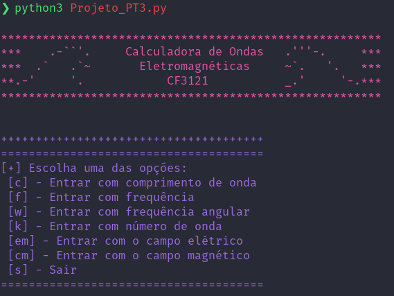
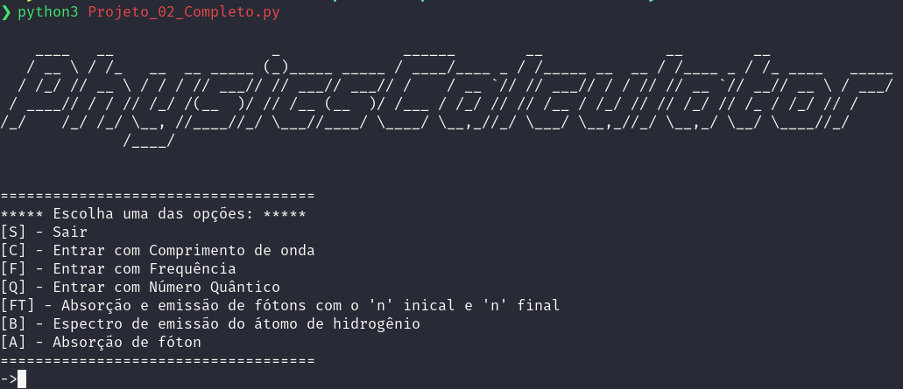

# Codigos-CC3121
Repositório criado para armazenar os programas desenvolvidos na Matéria de Tópicos de Física Moderna do Centro Universitário FEI, no curso de Ciências da Computação.O repósitório contém 2 projetos que tratam de assuntos como: Comprimento de Ondas, Modelo Atômico de Bohr, Frequência das Ondas, entre outros tópicos estudados ao longo do semestre.

## Instalação

Será necessário possuir um interpretador Python e o pacote pip instalados em sua máquina. Primeiro, instale as dependências necessárias:

```bash
pip install requirements.txt
```
Após isso, é só executar os programas através do comando:

```bash
python3 Projeto_01.py
```


ou 

```bash
python3 Projeto_02.py
```
## Exemplo

Projeto 01:


Projeto 02:


## Desenvolvedores

João Pedro Rosa Cezarino – [@Rosa_jaoc](https://twitter.com/@Rosa_jaoc) – [@_akajhon](https://instagram.com/_akajhon) - jp_2602@hotmail.com

Vítor Martins Oliveira - [@Vihmartiinss](https://twitter.com/@Vihmartiinss)– [@vitinho.mrt](https://instagram.com/vitinho.mrt) - vihmar2002@hotmail.com

Lucca Bonsi Guarreschi - [@Lucca_Guareschi](https://twitter.com/@Lucca_Guareschi)– [@luccaguareschi](https://instagram.com/luccaguareschi) - luccaguareschi@gmail.com

[https://github.com/akajhon/Codigos-CC3121](https://github.com/akajhon/)

Qualquer dúvida entre em contato!

## Contribuições

1. Faça o _fork_ do projeto (<https://github.com/akajhon/Codigos-CC3121/fork>)
2. Crie uma _branch_ para sua modificação (`git checkout -b feature/fooBar`)
3. Faça o _commit_ (`git commit -am 'Add some fooBar'`)
4. _Push_ (`git push origin feature/fooBar`)
5. Crie um novo _Pull Request_
